🚧 This is a companion repository for the [Hands on AWS CDK Book](https://www.oreilly.com/library/view/hands-on-aws-cdk/9781098158767/), currently in prerelease. All project code is currently in draft format. Please feel free to open issues in the repository if you encounter any problems, bugs, or see opportunities to improve.

# Hands on AWS CDK Book Projects

This repository contains all project components, tutorials, and final project outputs for the Hands on AWS CDK book by Sam Ward Biddle and Kyle T. Jones, published by O'Reilly Media.

The main branch is a completed version of the shared project from the book: Home Energy Coach. Each chapter has a branch so that you can follow along with the project through each section of the book. Use the table of contents below to navigate to the project for each chapter.

## Final Project Architecture

```mermaid

%%{
  init: {
    "theme": "dark",
    "scale": "2"
  }
}%%

flowchart LR

InputData[Electric Utility Data ⚡️]-->
inputS3[Custom S3 Bucket 🪣<br/>Raw Data]

inputS3-->
EventBridge1[Amazon EventBridge 🎬<br/>Data Upload Event Trigger]

EventBridge1-->
SNS1[Simple Notification Service 📲<br/>Upload Notification]

EventBridge1-->
Lambda1(Custom Lambda Function 🧮<br/>Transform CSV to JSON)

Lambda1-->
EventBridge2[Amazon EventBridge 🎬<br/>Energy Usage Calculator Trigger]

EventBridge2-->
Lambda2(Custom Lambda Function 🧮<br/>Calculate Energy Usage)

Lambda2-->
DynamoDBTable(DynamoDB 🫙<br/>Calculated Energy Data)

Lambda2-->
analyticsS3(Custom S3 Bucket 🪣<br/>Calculated Energy Data)

Lambda2-->
SNS2[Simple Notification Service 📲<br/>Send Calculator Output]

DynamoDBTable-->
API(REST API 👾<br/>Query DynamoDB )

DynamoDBTable-->
RAGConstruct(Retrieval Augmented Generation Construct 🤖<br/>Chat-based search and summary of Electric Usage Records)

DynamoDBTable-->
GrafanaDashboard(Grafana Dashboard 📊<br/>Custom Resource<br/>Display Electric Usage Records)

API-->
Amplify(Amplify Web Application 🖥️<br/>Custom Construct<br/>Upload and Display Data)


```

## Table of Contents

- [Chapter 1 - Set up your development environment](https://github.com/hands-on-aws-cdk-book/hands-on-aws-cdk-book-projects/tree/chapter-1/)
- [Chapter 2 - Hello CDK](https://github.com/hands-on-aws-cdk-book/hands-on-aws-cdk-book-projects/tree/chapter-2/)
- [Chapter 3 - Introducing CDK and AWS constructs](https://github.com/hands-on-aws-cdk-book/hands-on-aws-cdk-book-projects/tree/chapter-3/)
- [Chapter 4 - Building a custom construct](https://github.com/hands-on-aws-cdk-book/hands-on-aws-cdk-book-projects/tree/chapter-4/)
- [Chapter 5 - Building Multi-Stack CDK Applications](https://github.com/hands-on-aws-cdk-book/hands-on-aws-cdk-book-projects/tree/chapter-5/)
- [Chapter 6](https://github.com/hands-on-aws-cdk-book/hands-on-aws-cdk-book-projects/tree/chapter-6/)
- [Chapter 7](https://github.com/hands-on-aws-cdk-book/hands-on-aws-cdk-book-projects/tree/chapter-7/)
- [Chapter 8](https://github.com/hands-on-aws-cdk-book/hands-on-aws-cdk-book-projects/tree/chapter-8/)
- [Chapter 9](https://github.com/hands-on-aws-cdk-book/hands-on-aws-cdk-book-projects/tree/chapter-9/)
- [Chapter 10](https://github.com/hands-on-aws-cdk-book/hands-on-aws-cdk-book-projects/tree/chapter-10/)
- [Chapter 11](https://github.com/hands-on-aws-cdk-book/hands-on-aws-cdk-book-projects/tree/chapter-11/)
- [Chapter 12](https://github.com/hands-on-aws-cdk-book/hands-on-aws-cdk-book-projects/tree/chapter-12/)
- [Chapter 13](https://github.com/hands-on-aws-cdk-book/hands-on-aws-cdk-book-projects/tree/chapter-13/)
